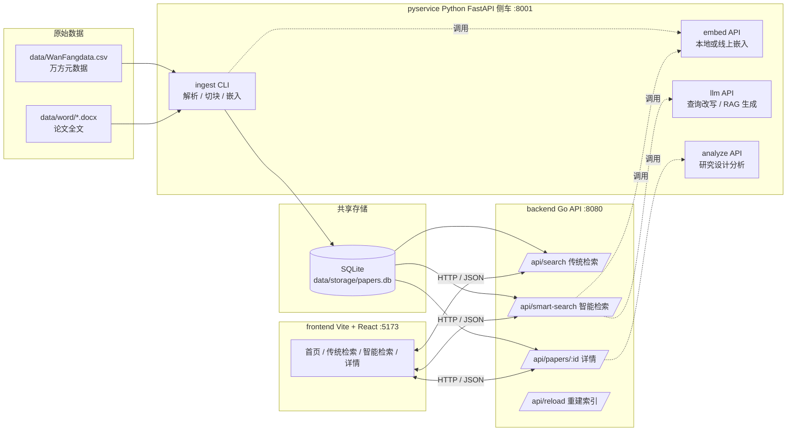

# xcj-dev：信息存储与检索系统

一句话定位：一个把 1000 篇万方学术文献从原始 Word 解析、入库、双路检索到大模型综述生成全链路打通的本地化教学型系统。

本仓库是「信息存储与检索」课程集体作业的工程实现。整体结构沿用 [docs/01-数据预处理.md](docs/01-数据预处理.md) → [docs/02-数据存储.md](docs/02-数据存储.md) → [docs/03-检索与排序.md](docs/03-检索与排序.md) → [docs/04-RAG生成.md](docs/04-RAG生成.md) → [docs/05-前端设计.md](docs/05-前端设计.md) 这条由数据到界面的主干，但在工程实现上做了两点务实的折衷：默认使用 SQLite + 内嵌向量替代 MySQL + ChromaDB，便于零依赖跑起来；Python 仅承担文档解析、嵌入计算、LLM 调用三类「重活」，主业务由 Go 后端承担，前端使用 Vite + React + TS 实现可视化交互。下文按「跑起来 → 看明白 → 改得动」三条线索展开。

参考文档：
- [docs/00-架构总览.md](docs/00-架构总览.md)：自顶向下贯穿全栈的系统设计
- [docs/01-数据预处理.md](docs/01-数据预处理.md)：如何把 Word + CSV 解析为统一论文对象
- [docs/02-数据存储.md](docs/02-数据存储.md)：论文主表 + 研究设计字段 + 向量索引
- [docs/03-检索与排序.md](docs/03-检索与排序.md)：传统模式 / 智能模式的检索分流
- [docs/04-RAG生成.md](docs/04-RAG生成.md)：大模型 RAG 生成模块
- [docs/05-前端设计.md](docs/05-前端设计.md)：前端页面信息架构

---

## 一、总体架构



要点：
- Python 仅在两个时机被调用——离线 ingest（重活集中爆发）、线上嵌入 / LLM（按需调用）。
- Go 后端持有 SQLite 句柄，承担 BM25 字段加权 + 向量召回 + RRF 融合 + 业务路由。
- 前端只与 Go 后端通信，不直连 Python，避免 CORS 与密钥外泄。

---

## 二、目录结构

```
xcj-dev/
├── docs/                      课程设计文档（00 架构总览 + 01..05 分章）
├── README.md                  当前文件
├── Makefile                   常用快捷目标
├── .env.example               环境变量模板，复制成 .env
├── .gitignore
│
├── backend/                   Go 后端（module xcjdev/backend）
│   ├── go.mod
│   ├── cmd/
│   │   └── server/main.go     HTTP 入口，监听 :8080
│   ├── internal/              业务包（搜索、排序、存储、配置等）
│   └── migrations/            SQL 迁移脚本
│
├── pyservice/                 Python 侧车（FastAPI + ingest CLI）
│   ├── main.py                uvicorn 入口 (pyservice.main:app)
│   ├── ingest.py              数据摄取 CLI（python -m pyservice.ingest）
│   ├── requirements.txt       Python 依赖（含 sentence-transformers 等）
│   └── server.sh              备用启动脚本
│
├── frontend/                  Vite + React + TS + Tailwind
│   ├── index.html
│   ├── package.json
│   ├── vite.config.ts
│   └── src/                   页面 / 组件 / API client
│
├── data/                      数据目录（被 .gitignore 部分忽略）
│   ├── WanFangdata.csv        万方元数据
│   ├── word/                  原始 docx 文件
│   └── storage/               运行时产物（papers.db / 日志）
│
├── scripts/                   运维脚本（本次新增）
│   ├── dev.sh                 一键启动三件套
│   ├── ingest.sh              数据摄取 + 通知后端 reload
│   ├── build.sh               生产构建到 dist/
│   └── format-check.sh        go vet / gofmt / compileall / tsc
│
└── dist/                      构建产物（build 后生成）
    ├── server                 Go 二进制
    └── web/                   前端静态资源
```

---

## 三、快速开始

### 3.1 前置依赖

| 工具       | 最低版本 | 说明                                                |
|------------|----------|-----------------------------------------------------|
| Go         | 1.22+    | 后端语言，需启用 cgo 以使用 SQLite（macOS 默认即可）|
| Python     | 3.10+    | 侧车语言，建议用 venv 隔离                          |
| Node.js    | 18+      | 前端构建（推荐 20 LTS）                             |
| Git        | 2.0+     | 拉取源码                                            |
| curl       | 任意     | scripts/ingest.sh 用它通知后端 reload               |

可选：
- 国内网络环境推荐配置 `npm config set registry https://registry.npmmirror.com`
- 嵌入模型若走本地路线，会下载 `BAAI/bge-small-zh-v1.5`（约 100MB），首次较慢

### 3.2 配置环境变量

```bash
cp .env.example .env
# 根据需要修改 LLM_API_KEY / LLM_BASE_URL / EMBED_BACKEND 等
```

`.env` 不会进入 Git（已在 `.gitignore`）。

### 3.3 首次摄取数据

```bash
# 完整版（含向量嵌入，较慢）
bash scripts/ingest.sh

# 快速跑通：跳过向量，先把元数据 + 全文写入 SQLite
bash scripts/ingest.sh --no-embed

# 仅处理前 100 篇，便于调试
bash scripts/ingest.sh --limit 100
```

摄取完成后会自动调用 `POST /api/reload`，若后端尚未启动则忽略（首次摄取时通常如此）。

### 3.4 启动开发环境

```bash
bash scripts/dev.sh
# 或:  make dev
```

脚本会同时启动：

| 组件          | 地址                      | 日志                       |
|---------------|---------------------------|----------------------------|
| Python 侧车   | http://127.0.0.1:8001     | data/storage/py.log        |
| Go 后端       | http://127.0.0.1:8080     | data/storage/api.log       |
| Vite 前端     | http://localhost:5173     | data/storage/web.log       |

日志会通过 `tail -F` 实时聚合到前台，Ctrl-C 会触发 trap 清理所有子进程。

跳过某些组件：

```bash
bash scripts/dev.sh --no-frontend    # 调后端时
bash scripts/dev.sh --no-py          # 只跑 Go + 前端（不可用智能检索）
```

打开浏览器访问 `http://localhost:5173` 即可。

---

## 四、环境变量说明

`.env.example` 中字段一览：

| 变量              | 默认值                                | 含义                                                          |
|-------------------|----------------------------------------|---------------------------------------------------------------|
| DB_DRIVER         | sqlite                                 | 数据库驱动。可选 `sqlite` / `mysql`                            |
| DB_DSN            | ./data/storage/papers.db               | DSN。SQLite 为文件路径；MySQL 见下方示例                       |
| PY_SERVICE_URL    | http://127.0.0.1:8001                  | Go 后端调用 Python 侧车的基地址                                |
| LLM_BASE_URL      | https://api.openai.com/v1              | OpenAI 兼容协议端点（DashScope、智谱、Qwen 等均可填写）         |
| LLM_API_KEY       | sk-replace-me                          | LLM 鉴权。仅 Python 侧读取，不会下发到前端                     |
| LLM_MODEL         | gpt-4o-mini                            | LLM 模型名                                                    |
| LLM_TEMPERATURE   | 0.2                                    | 生成温度，0~1                                                  |
| EMBED_BACKEND     | local                                  | 嵌入后端。`local` = sentence-transformers；`openai` = 线上     |
| EMBED_MODEL       | BAAI/bge-small-zh-v1.5                 | 嵌入模型名（本地为 HuggingFace ID，线上为 OpenAI 嵌入名）      |
| API_ADDR          | :8080                                  | Go 后端监听地址                                                |
| CORS_ORIGIN       | http://localhost:5173                  | 允许跨域的前端来源                                             |

MySQL DSN 示例：

```
DB_DRIVER=mysql
DB_DSN=user:pass@tcp(127.0.0.1:3306)/papers?parseTime=true&charset=utf8mb4&loc=Local
```

---

## 五、数据库切换：SQLite → MySQL

默认情况下后端使用 `data/storage/papers.db` 这一个 SQLite 文件，简单且无需外部依赖。生产或多人协作需要切换到 MySQL 时，遵循以下步骤：

1. 在 MySQL 中建库：
   ```sql
   CREATE DATABASE papers DEFAULT CHARACTER SET utf8mb4 COLLATE utf8mb4_unicode_ci;
   ```
2. 修改 `.env`：
   ```
   DB_DRIVER=mysql
   DB_DSN=user:pass@tcp(127.0.0.1:3306)/papers?parseTime=true&charset=utf8mb4
   ```
3. 让后端跑迁移（首次启动会自动应用 `backend/migrations/` 下脚本）。
4. 重新执行 `bash scripts/ingest.sh`，这次写入的就是 MySQL；ingest 完成后会通知后端重建内存索引。
5. 验证：`curl 'http://127.0.0.1:8080/api/search?q=test&size=1'`。

注意：MySQL 不内置 BM25，所以 BM25 部分由后端在 Go 侧用 `bluge` / 自实现倒排维护索引（默认从数据库冷启动构建一次，运行时增量更新由 `/api/reload` 触发）。

---

## 六、检索流程详解

[docs/03-检索与排序.md](docs/03-检索与排序.md) 中将检索拆为「客观分流」 + 「双路融合」。本仓库的实现遵循同样的分流策略，但把对外 API 拆为两条独立路径：

### 6.1 模式 A：传统检索（`/api/search`）

适用于用户已经清楚要什么、希望对字段进行精确过滤的场景。流程：

1. **结构化过滤**：根据查询参数（年份区间、作者、关键词白名单等）生成 `Allowed_IDs` 候选集。
2. **BM25 字段加权打分**：对候选集执行字段加权 BM25。字段权重如下：

   | 字段          | 权重 | 说明                                           |
   |---------------|------|------------------------------------------------|
   | 标题 title    | 8    | 命中即极强相关                                 |
   | 关键词 keywords| 5   | 作者标注的主题词，密度高                       |
   | 摘要 abstract | 3    | 概括性强但篇幅短                               |
   | 研究设计 design| 4   | 方法学描述，对学术检索价值高（来自第一部分抽取）|
   | 正文 body     | 1    | 兜底，避免错漏                                 |

3. **分页输出**：默认每页 20 条，按 BM25 总分降序返回。

特点：可解释、稳定、对查询拼写敏感，适合做对照基线。

### 6.2 模式 B：智能检索（`/api/smart-search`）

适用于用户用自然语言描述需求、不确定字段关键词的场景。流程：

1. **LLM 查询改写**：把用户原问题拆成「核心实体 / 同义术语 / 方法学限定」，重写为更适合 BM25 命中的查询；同时保留原问题用于向量召回。
2. **双路检索**：
   - 路 1：用改写后的查询走 6.1 节相同的字段加权 BM25，取 Top K（默认 50）。
   - 路 2：用原问题做嵌入，对 SQLite 中持久化的向量做余弦近邻召回，取 Top K。
3. **RRF 互惠排名融合**：对两路结果按 `score = Σ 1 / (k + rank_i)` 融合（默认 k=60），得到「黄金排行榜」。
4. **可选 Top 5 RAG**：若请求带 `rag=true`，截取黄金榜 Top 5，拼装上下文（标题 + 摘要 + 研究设计），交给 LLM 生成结构化综述。

返回体同时包含两路原始排名与最终融合后的列表，便于前端做调试可视化（见 [docs/05-前端设计.md](docs/05-前端设计.md)）。

---

## 七、API 一览

| 方法 | 路径                          | 用途                                              | 备注                              |
|------|-------------------------------|---------------------------------------------------|-----------------------------------|
| GET  | /healthz                      | 健康检查                                          | 返回 `{"ok":true}`                |
| GET  | /api/search                   | 传统检索（BM25 + 字段加权）                       | 参数: q, year_from, year_to, page |
| POST | /api/smart-search             | 智能检索（LLM 改写 + 双路 + RRF + 可选 RAG）       | body: {query, rag, top_k}         |
| GET  | /api/papers/:id               | 论文详情（含研究设计大字段、引用元数据）           |                                   |
| GET  | /api/papers/:id/analyze       | 触发研究设计分析（调用 Python 侧车）              | 结果会缓存                        |
| GET  | /api/keywords/top             | 高频关键词分布（用于首页可视化）                  | 参数: limit                       |
| POST | /api/reload                   | 通知后端重建内存索引（ingest.sh 自动调用）        | 无需鉴权（仅监听本地）            |
| GET  | /api/stats                    | 当前库的论文数量、覆盖时段、向量进度等             |                                   |

Python 侧车直暴的接口（仅供 Go 后端调用，前端不应直连）：

| 方法 | 路径               | 用途                            |
|------|--------------------|---------------------------------|
| POST | /embed             | 文本批量嵌入                    |
| POST | /llm/rewrite       | 查询改写                        |
| POST | /llm/generate      | 综述生成（RAG）                 |
| POST | /analyze/design    | 研究设计抽取与分析              |

---

## 八、常见问题

**Q1. 嵌入太慢，第一次 ingest 卡了好几分钟怎么办？**

本地 `sentence-transformers` 在 CPU 上确实较慢，1000 篇大概 5-10 分钟。两种选择：
1. 跳过向量，先把功能跑通：`bash scripts/ingest.sh --no-embed`，传统检索照常工作；
2. 切线上嵌入：在 `.env` 中把 `EMBED_BACKEND=openai`，并填好 `LLM_API_KEY`，再重跑 ingest。

**Q2. 智能检索报错 "LLM call failed"？**

依次检查：
- `.env` 中 `LLM_BASE_URL` 与 `LLM_API_KEY` 是否正确（DashScope 用 `https://dashscope.aliyuncs.com/compatible-mode/v1`）；
- Python 侧车日志 `data/storage/py.log`，搜索 `httpx` 或 `Timeout`；
- 是否能在终端 `curl $LLM_BASE_URL/models -H "Authorization: Bearer $LLM_API_KEY"` 拿到模型列表。

**Q3. `go run ./cmd/server` 提示 "no required module provides package ..."？**

请确认进入到 `backend/` 目录再操作：

```bash
cd backend
go mod tidy
go run ./cmd/server
```

`scripts/dev.sh` 中已经处理过这一点；只是手工调试时容易在仓库根目录执行而踩坑。

**Q4. 首次 `npm install` 卡住很久？**

```bash
cd frontend
npm install --no-audit --no-fund --registry=https://registry.npmmirror.com
```

或者一次性配置：`npm config set registry https://registry.npmmirror.com`。

**Q5. SQLite 文件被锁住，提示 `database is locked`？**

通常是 ingest 和 dev.sh 并发写同一个库。先停掉 `dev.sh`，让 ingest 独占完成，再重启。后端在生产环境建议切 MySQL。

**Q6. 前端访问 `http://localhost:5173` 提示 CORS？**

检查 `.env` 中 `CORS_ORIGIN` 是否与浏览器实际访问的来源完全一致（注意 `http` vs `https`、端口号）。

---

## 九、开发提示

- **热重载**：
  - 后端：当前未启用 air，重启 Go 进程方式是停 `dev.sh` 再起；或单独 `cd backend && go run ./cmd/server`。
  - Python：uvicorn 已传 `--reload`，改 `pyservice/*.py` 会自动重启。
  - 前端：Vite 自带 HMR，改 `frontend/src/**` 浏览器即时刷新。
- **重建索引**：写库以外的更新（例如批量校正关键词）后，调用 `curl -X POST http://127.0.0.1:8080/api/reload` 让后端丢弃内存索引并重建。
- **日志位置**：统一落到 `data/storage/{py,api,web}.log`，方便事后 `grep ERROR`。
- **格式与静态检查**：`make check` 会跑 `go vet` / `gofmt -l` / `python -m compileall` / `tsc --noEmit`，全部错误都打印，不会因单一项中断。
- **生产构建**：`make build` 产物在 `dist/`，可与 nginx + systemd 组合部署；Python 侧车建议以 `gunicorn -k uvicorn.workers.UvicornWorker` 形式跑。

---

## 十、致谢与说明

- 数据集：万方学术（仅用于课程教学，请勿外传或商用）。原始 docx 由教师统一提供，对应元数据存于 `data/WanFangdata.csv`。
- 课程：信息存储与检索（集体作业）。设计文档由小组协作完成，分章见 [docs/](docs/)，顶层架构见 [docs/00-架构总览.md](docs/00-架构总览.md)。
- 工程实现：本仓库由小组在 1-2 周内完成。MySQL → SQLite、ChromaDB → 内嵌向量是出于「单机零依赖跑通」的工程裁剪，文档中保留了原始设计描述以便对照学习。
- 第三方依赖（部分）：Go 侧 `bluge` / `gorm` / `go-sqlite3`；Python 侧 `fastapi` / `sentence-transformers` / `python-docx`；前端 `react` / `vite` / `tailwindcss`。许可证请见各项目主页。

如发现错误或希望反馈改进意见，请在课程协作渠道留言，或直接在仓库内提交 issue / PR。
