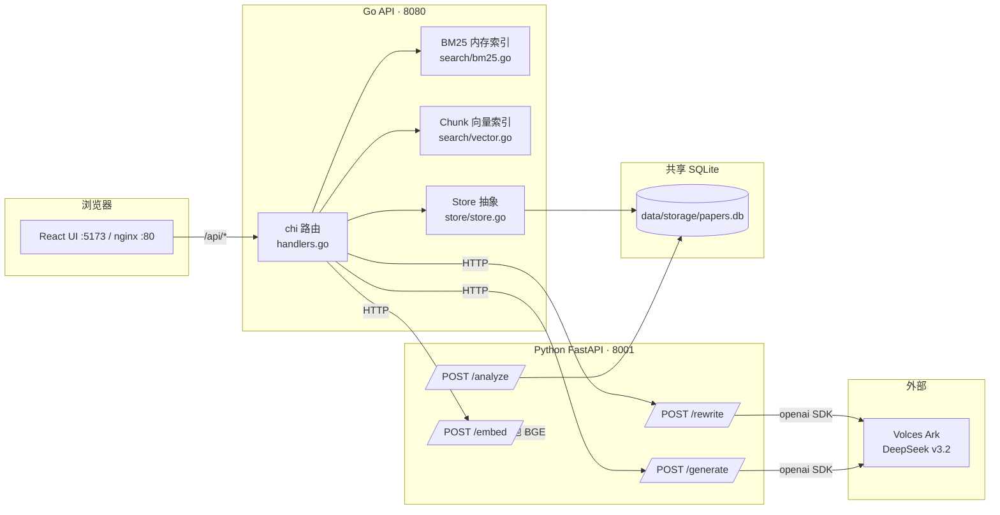

# 架构总览

> 本文件给出整套系统的顶层视图：组件如何分工、数据如何流转、接口如何对齐、部署如何摆放。读完本文应足以独立维护与扩展系统；细节请按需翻到 [01-数据预处理](01-数据预处理.md) 至 [05-前端设计](05-前端设计.md)。

## 1. 设计原则

| 编号 | 原则 | 落地表现 |
| --- | --- | --- |
| P1 | **职责单一** | Go 抓主业务（检索、排序、API、并发安全）；Python 只做"重活"（文档解析、向量化、LLM）；前端只做展示 |
| P2 | **接口稳定** | 前后端走平铺 JSON；任何字段重命名必须前后端一起改；类型层（TS + Go struct）作为唯一真相 |
| P3 | **优雅降级** | LLM 失败 → 关键词启发式；嵌入失败 → BM25-only；Python 离线 → 至少传统检索可用 |
| P4 | **零外部依赖默认** | 默认 SQLite + 本地嵌入；MySQL/ChromaDB 改一行 env 即可切换 |
| P5 | **可重复构建** | 三件套全部有 Dockerfile，docker-compose 一键起 |

## 2. 组件与端口



| 服务 | 进程 | 端口 | 主要依赖 | 启动命令 |
| --- | --- | --- | --- | --- |
| frontend | Node/Nginx | 5173 (dev) / 80 (docker) | React, Vite, Tailwind（暗色科技终端风）；Node 由 **fnm** 管理 | `npm run dev` |
| backend | Go binary | 8080 | modernc/sqlite, chi | `go run ./cmd/server` |
| pyservice | Python uvicorn | 8001 | FastAPI, openai SDK（火山方舟 DeepSeek `deepseek-v3-2-251201`）, sentence-transformers（本地 `BAAI/bge-small-zh-v1.5`）；依赖由 **uv** 管理 | `uvicorn pyservice.main:app` |
| ingest | Python CLI | — | python-docx, pandas | `python -m pyservice.ingest` |

> 工具链：Python 用 `uv`、Node 用 `fnm`、Go 原生 `go`。远端部署端口为 Go 19080 / Py 19001 / Vite 19173（本地默认 8080 / 8001 / 5173）。嵌入固定走本地 BGE（火山方舟不提供兼容 `/embeddings`），LLM 走火山方舟 DeepSeek（OpenAI 兼容协议）。

## 3. 数据生命周期

```
Word + CSV
   ↓ pyservice.ingest（一次性）
SQLite: papers_master / paper_chunks
   ↓ backend 启动时 / /api/reload
内存中的 BM25 Index + Chunk Vectors（带 RWMutex）
   ↓ 用户检索
JSON 响应给 React
```

### 3.1 摄取（pyservice/ingest.py）

- 读 `data/WanFangdata.csv`（GBK），用 chardet 探测编码后映射列名：题名→title、刊名→source、关键词→keywords 等
- 遍历 `data/word/*.docx`，状态机抽取「研究设计」章节，500/100 字滑动窗口切块
- 标题清洗后与 CSV 行模糊匹配，把作者/年份/期刊/摘要写入 `papers_master`
- 嵌入：local 后端用 `sentence-transformers + BAAI/bge-small-zh-v1.5`，openai 后端走 `/v1/embeddings`
- 字段层 token：与 Go 端 `search.Tokenize` 完全等价的纯函数（ASCII 词 + 汉字字符 + 相邻 bigram），便于后端无需再分词
- 向量编码：float32 little-endian → base64 → BLOB（与 Go `store.EncodeVector` 对称）

### 3.2 存储 schema（SQLite，可一键切 MySQL）

`papers_master`：paper_id PK、title/doi/publish_year/author/keywords/abstract/source_journal/research_design_text、各字段 `*_tokens`、raw_body。年份/作者/doi 普通索引。

`paper_chunks`：chunk_id PK、paper_id FK、chunk_index/paragraph_index/offset_start、chunk_text、embedding BLOB。paper_id 普通索引。

`search_history`：mode/query_text/filters/created_at，调试与审计用。

NULL 兼容：所有 Scan 路径使用 `COALESCE` 把 NULL 列归零，避免 modernc/sqlite 对 NULL→int 报错。

## 4. 检索流程

### 4.1 模式 A · 传统检索

```
filters → SQL 过滤 papers_master → allowed_ids
            ↓
查询分词 → Index.SetAllowed → QueryBM25 → 字段加权
            ↓
按 page/page_size 分页 → 写 history → 返回
```

字段权重（与 [03-检索与排序.md](03-检索与排序.md) 一致，已写入 `DefaultFieldWeights`）：

| 字段 | 权重 |
| --- | --- |
| 标题 | 8.0 |
| 关键词 | 5.0 |
| 摘要 | 3.0 |
| 研究设计 | 4.0 |
| 正文 | 1.0 |

### 4.2 模式 B · 智能检索

```
q → pyclient.Rewrite → {filter_conditions, search_payload}
        ↓                            ↓
   SQL 过滤                core_semantic_sentence 嵌入
   (allowed_ids)                 ↓ /embed
        ↓                  TopKChunksByVector
   关键词拼接                  ↓
   BM25 (listA)             AggregateChunksToPapers (listB)
        ↘                  ↙
              RRF(60, 50)
                  ↓
            golden 排行榜
```

RRF 公式 `1/(k+rank_a) + 1/(k+rank_b)`，k=60。

容错路径：
- LLM 失败 → 使用 `_fallback_rewrite`（直接分词 + 年份正则）
- 嵌入失败 → 跳过向量路径，golden = listA

### 4.3 RAG 生成（/api/analyze/generate）

1. 取前 5 个 paper_id
2. 对每篇：查 chunks 表，用 q 的向量做余弦排序，挑 top chunk；嵌入失败时降级为「最长 chunk」
3. 拼装 `GeneratePaper`（title/doi/author/abstract/research_design_text/top_chunk_text）
4. Python `/generate` 用学术 Prompt（DOI 溯源 + 零幻觉 + 总-分-总）调 LLM，temperature=0.2
5. 返回 `{answer, citations[]}`

### 4.4 学术智能体（本轮 T1–T5）

在既有「检索 + RAG 综述」主干上，本轮扩出一组面向用户问题与单篇阅读的学术智能体能力，完整设计见 [06-学术智能体.md](06-学术智能体.md)。各能力均复用 4.1~4.3 的检索与排序底座，不引入新的检索算法：

- **T1 · 详情页连续全文**：`GET /api/papers/{id}` 直接返回 `full_text`（= 预处理写入 `papers_master.raw_body` 的连续拼接原文）。详情页正文以单一连续文本展示并支持折叠，原 chunk 切块降级为「命中片段/证据解释」区，不再作为正文主形态。
- **T3 · 文献综述双模式**：`/api/review/auto` 走 smart 检索取 Top5 自动选文，`/api/review/manual` 由 doi/title 精确定位库内单篇或直接接收粘贴 `text`；两者都复用既有综述 Prompt（不改），只在选文方式上分流。
- **T4 · 智能问答 RAG-QA**：`/api/qa/answer` 复用 smart 检索（rewrite→BM25∪向量→RRF）得到 golden，按「默认 Top5 / 断崖兜底 Top3 并标记证据不足」选证据，拼装上下文交 Python `/qa`（独立的新 QA Prompt，只基于证据直接回答、无证据则明确说明），references 表由 Go 侧组装。
- **T5 · 详情页四智能体**：以单篇论文全字段（含 `full_text`）为上下文——`chat`（AI 同读，越界答「论文未提供」）、`summary`（结构化概要/方法/结果/关键词）、`mindmap`（产出 mermaid `mindmap`）各走独立 Prompt 调 Python；`related`（相关文献）则**纯 Go 实现、不调 LLM**：以该论文 keywords 做 BM25、abstract 向量做语义召回，双路 RRF 融合去自身取 TopN=20。

## 5. API 一览

| 方法 | 路径 | 用途 | 关键字段 |
| --- | --- | --- | --- |
| GET | `/api/health` | 健康检查 | `{status}` |
| GET | `/api/stats` | 全局统计 | `paper_count, chunk_count, year_dist, top_journals[].name` |
| POST | `/api/search/traditional` | 字段加权检索 | 请求 `{q,author,year:int,journal,keywords,sort,page,page_size}` / 响应 `{hits,total}` |
| POST | `/api/search/smart` | 重写+双路+RRF | 请求 `{q}` / 响应 `{golden,rewrite,list_bm25,list_vector}` |
| POST | `/api/analyze/generate` | Top5 RAG | 请求 `{q,paper_ids}` / 响应 `{answer,citations}` |
| GET | `/api/papers/{id}` | 论文详情（平铺） | `{paper_id,title,doi,publish_year,author,keywords,abstract,source_journal,research_design_text,full_text,chunks[]}`（**新增 `full_text`** = raw_body 连续原文，见 06 章 T1） |
| GET | `/api/papers/{id}/chunks?q=` | 切块（可按 q 重排序） | `{chunks[]}` |
| GET | `/api/history?limit=` | 检索历史 | `{history[]}` |
| POST | `/api/analyze/run` | 离线分析 | `{kind: year\|authors\|keywords\|journals\|cooccurrence\|tfidf, params}` / `{data}` |
| POST | `/api/reload` | 摄取后热重建索引 | `{status}` |
| POST | `/api/qa/answer` | 智能问答 RAG-QA（复用 smart 检索取证据，新 QA Prompt 直接作答，见 06 章 T4） | 请求 `{question,filters?}` / 响应 `{answer,evidence_sufficient,references[]}` |
| POST | `/api/review/auto` | 文献综述·自动模式（smart 检索 Top5 → 现有综述 Prompt，见 06 章 T3） | 请求 `{q}` / 响应 `{answer,citations}` |
| POST | `/api/review/manual` | 文献综述·自选模式（doi/title 精确定位或 text 直接粘贴 → 现有综述 Prompt） | 请求 `{doi?,title?,text?}` / 响应 `{answer,citations,matched}` |
| POST | `/api/papers/{id}/chat` | 详情页智能体·AI 同读（基于单篇论文全文作答，见 06 章 T5） | 请求 `{question}` / 响应 `{answer,evidence_snippets[]}` |
| POST | `/api/papers/{id}/summary` | 详情页智能体·AI 概要（结构化概要/方法/结果/关键词） | 请求空 / 响应 `{summary,method,result,keywords[]}` |
| POST | `/api/papers/{id}/mindmap` | 详情页智能体·思维导图（产出 mermaid `mindmap`） | 请求空 / 响应 `{mermaid}` |
| POST | `/api/papers/{id}/related` | 详情页智能体·相关文献（**纯 Go 双路 + RRF，不调 LLM**） | 请求空 / 响应 `{related_papers[]}` |

Python 内部接口（仅 Go 侧消费）：

| 方法 | 路径 | 用途 |
| --- | --- | --- |
| POST | `/embed` | 文本批量嵌入 |
| POST | `/rewrite` | LLM 查询重写 |
| POST | `/generate` | RAG 生成 |
| POST | `/analyze` | 数据分析 |

## 6. 并发与一致性

- BM25 索引重建走 `Handlers.Reload`，全过程握 `sync.RWMutex` 写锁
- 所有 reader handler 通过 `snapshot()` 拿 `(idx, chunks, papersMap)` 快照，避免读到半构造状态
- `Index.SetAllowed` 当前会原地写入 mask；同一索引被多个请求并发设置时存在脏读风险。**生产化建议**：把 allowed 作为查询参数 per-call 传入而非状态机
- SQLite 写一律由 ingest 进程独占；后端只读

## 7. 部署拓扑

### 7.1 本地开发

```
scripts/dev.sh
  ├─ uvicorn pyservice.main:app :8001       (log: data/storage/py.log)
  ├─ go run ./cmd/server         :8080      (log: data/storage/api.log)
  └─ npm run dev                 :5173      (log: data/storage/web.log)
```

凭据：`.env` / 脚本中硬编码 DeepSeek/Volces 三件套（`LLM_API_KEY/LLM_BASE_URL/LLM_MODEL`）；外部环境变量优先级最高。

### 7.2 Docker 一键起

```
docker compose up -d
  ├─ pyservice  :8001  ← FastAPI + 本地 BGE 嵌入
  ├─ backend    :8080  ← Go HTTP API, distroless 镜像
  ├─ frontend   :8088  ← Nginx 静态托管 + /api 反代到 backend
  └─ ingest            ← profile 触发，一次性容器跑摄取
```

Volume 拓扑：

| 主机路径 | 容器路径 | 用途 |
| --- | --- | --- |
| `./data/storage` | `/data` | SQLite 数据库读写共享 |
| `./data/word` | `/data-source/word` (RO) | 原始 docx |
| `./data/WanFangdata.csv` | `/data-source/WanFangdata.csv` (RO) | CSV 元数据 |
| named volume `hf_cache` | `/root/.cache/huggingface` | sentence-transformers 模型缓存（首次下载几百 MB） |

启动顺序：`pyservice`（healthcheck 通过）→ `backend`（depends_on）→ `frontend`。`ingest` 只在 `docker compose --profile ingest run --rm ingest` 时执行。

### 7.3 推荐生产形态

- pyservice：`uvicorn --workers $(nproc)` 或 `gunicorn -k uvicorn.workers.UvicornWorker -w 4 pyservice.main:app`
- backend：原生二进制即可。建议前面挂 Caddy/nginx 做 TLS 终止
- frontend：Vite 产物完全静态，可放 CDN
- 数据库：若数据量上 10k 篇起，切到 MySQL 8 + InnoDB 全文索引；向量库切到 Qdrant/Milvus，向 Go 端暴露 HTTP 检索

## 8. 已知局限

| 局限 | 影响 | 缓解 |
| --- | --- | --- |
| 中文分词用字符 + bigram 而非 jieba | 短词命中可能弱 | 后续 import jiebago 替换 `search.Tokenize` |
| 向量检索把所有 chunk 装内存 | 万级以上文献 OOM | 切外置向量库 |
| `Index.SetAllowed` 非线程局部 | 高并发下脏读 | 改 per-call 参数 |
| Volces Ark 不提供兼容 `/embeddings` | 必须本地跑 BGE | 切 OpenAI/dashscope 嵌入即可远端化 |
| ingest 进程未做 schema 迁移版本 | 重命名字段后旧 DB 不会自动 alter | 引入 `goose`/`alembic` 之类的迁移工具 |

## 9. 看代码路径

| 想看什么 | 入口文件 |
| --- | --- |
| 路由总表 | `backend/internal/api/server.go` |
| 业务 handler | `backend/internal/api/handlers.go` |
| BM25 / 向量 / RRF | `backend/internal/search/{bm25,vector,rrf}.go` |
| DB / 向量编解码 | `backend/internal/store/store.go` |
| Python 侧车主入口 | `pyservice/main.py` |
| 摄取主流程 | `pyservice/ingest.py` |
| 学报美学样式 | `frontend/src/index.css` + `frontend/tailwind.config.js` |
| 前端 API 客户端 | `frontend/src/api/client.ts` + `types.ts` |
| 智能问答页 | `frontend/src/pages/QA.tsx` |
| 文献综述页（自动/自选双模式） | `frontend/src/pages/Review.tsx` |
| 检索页（传统/智能/问答 tab 聚合） | `frontend/src/pages/Search.tsx` |
| 侧边导航 | `frontend/src/components/Sidebar.tsx` |
| 思维导图渲染组件（mermaid） | `frontend/src/components/Mindmap.tsx` |
