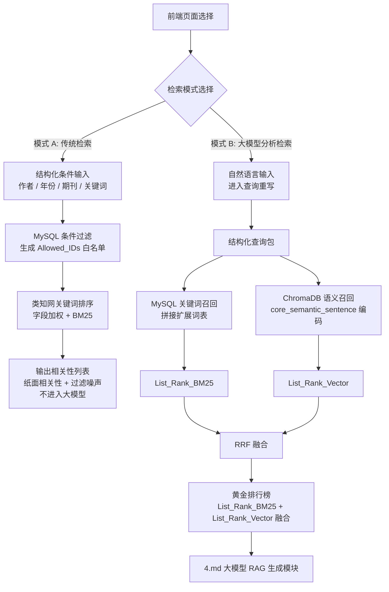

# 第三部分（增强版）：前端选择分流的稳健检索与排序模块

## 1. 设计定位

本模块的核心不是“让系统自己猜用户想做什么”，而是由前端页面明确选择检索模式。系统最顶层入口来自用户输入与前端 UI 勾选的客观特征，分流后各自执行对应策略。

- **模式 A：传统检索**
  - 用户只看文献，不进入大模型分析。
  - 系统尽力复刻知网式检索体验。
  - 必须提供相关性排序，同时尽量筛掉完全不相关的信息。
  - 直接读取作者、年份、关键词等结构化字段，可进行发表时间筛选、作者筛选和布尔检索判断。

- **模式 B：大模型分析检索**
  - 用户选择后才允许自然语言检索。
  - 系统先做查询理解，再进行双路检索与融合。
  - 结果可继续交给 [第四部分](04-RAG生成.md) 做上下文拼装与学术生成。
  - 只有该模式才允许自然语言查询进入重写流程。

这一设计的优势是职责边界清晰：前端决定模式，后端只负责执行该模式下的检索策略，避免后端误判查询意图带来的不稳定。

## 2. 总体流程

系统采用“前端模式选择 → 模式化检索 → 相关性排序 → 结果输出”的结构。

### 2.1 模式 A：传统检索

输入来自页面上用户直接填写的条件，例如：

- 作者
- 年份
- 期刊
- 学科
- 关键词
- 布尔条件

该模式下不调用大模型，不做自然语言重写，只做高可控检索。

### 2.2 模式 B：大模型分析检索

输入来自用户在前端勾选的“大模型分析检索”入口。

系统先把问题重写为结构化检索包，再进入关键词与语义双路检索。

结构化检索包通常包含两个部分：

- `filter_conditions`：用于 MySQL 条件过滤的客观约束。
- `search_payload`：用于后续检索的语义查询内容和扩展词表。

其中，`search_payload` 还应显式包含“研究设计检索”所需的术语，特别是方法、模型、算法与实验设置相关的词，例如：`随机森林模型`、`强化学习`、`回归分析`、`深度学习`、`DID`、`实验设计`。

但要注意，`research_design_terms` 是可选字段，可以为空数组 `[]`。也就是说，用户如果根本没有研究设计检索意图，就不需要传入这部分词表，系统也不会强行启用研究设计章节检索。

## 3. 模式 A：类知网传统检索设计

传统检索的目标是：尽量像知网那样稳、准、可解释。

### 3.1 结构化过滤

先对显式条件做精确过滤：

```sql
SELECT paper_id
FROM papers_master
WHERE publish_year = 2024
  AND author = '贾哲敏'
```

过滤后得到 `Allowed_IDs`，后续检索只能在该集合内进行。如果 `Allowed_IDs` 为空，则直接回退为全量放行，避免系统无结果崩溃。

### 3.2 关键词检索与字段加权

传统检索的核心不是简单全文匹配，而是带有字段权重的相关性排序。可用 Full-Text + BM25 近似实现，并对字段分别加权；其中标题、关键词、摘要、正文分别承担不同强度的相关性信号。

建议的字段权重如下：

- 标题：8.0
- 关键词：5.0
- 摘要：3.0
- 研究设计字段： 4.0
- 正文：1.0

可采用如下查询形式：

```sql
SELECT paper_id,
       MATCH(title) AGAINST(:q IN NATURAL LANGUAGE MODE) * 8.0 +
       MATCH(keywords) AGAINST(:q IN NATURAL LANGUAGE MODE) * 5.0 +
        MATCH(abstract) AGAINST(:q IN NATURAL LANGUAGE MODE) * 3.0 +
        MATCH(research_design_text) AGAINST(:q IN NATURAL LANGUAGE MODE) * 4.0 +
        MATCH(text) AGAINST(:q IN NATURAL LANGUAGE MODE) * 1.0 
        AS score
FROM papers_master
WHERE paper_id IN (:allowed_ids)
ORDER BY score DESC
LIMIT 200;
```

说明：这里的 `research_design_text` 不只是保底全文字段，而是研究设计驱动检索的关键入口之一。对于“采用随机森林模型”“研究强化学习”“基于实验设计”“使用 DID 方法”这类查询，系统应优先让研究设计章节参与匹配。如果后续补全了全文正文或更多章节字段，还可以继续扩展该字段集，但当前版本已经足以覆盖研究设计检索场景。

### 3.3 类知网稳健性策略

为了避免“检索到了很多，但全都不相关”，增加以下规则：

- 去除停用词、空词、过短词。
- 同义词扩展，例如“刺激-机体-反应”和“SOR模型”互相扩展。
- 标题完全不命中的论文降权，不直接删除，但默认排在后面。
- 如果候选集过大，优先保留标题、关键词命中更强的论文。
- 如果候选集过小，自动放宽到摘要与正文层。

### 3.4 传统模式输出

传统模式只返回相关论文列表和排序分数，不进入大模型分析。

输出包含：

- `paper_id`
- `relevance_score`
- `matched_fields`

其中 `matched_fields` 用于说明该论文主要命中了标题、关键词、摘要还是正文，方便后续人工解释与结果展示。

## 4. 模式 B：大模型分析检索设计

该模式仅在用户明确选择“大模型分析检索”时启用。这意味着系统不会自动判断用户想做什么，而是严格按照前端模式开关执行，避免传统检索与自然语言分析互相干扰。

### 4.1 查询重写

把自然语言问题转为结构化查询包：

```json
{
  "filter_conditions": {
    "publish_year": 2024
  },
  "search_payload": {
    "core_semantic_sentence": "政务短视频在SOR模型下的传播效果与媒介可信度研究",
    "academic_keywords": ["政务短视频", "SOR模型", "媒介可信度"],
    "synonyms_and_extensions": ["政务新媒体", "刺激-机体-反应", "短视频平台"],
    "potential_variables": ["持续使用意愿", "信任", "互动行为"],
    "research_design_terms": ["随机森林模型", "强化学习", "实验设计"]
  }
}
```

其中：

- `core_semantic_sentence` 负责路二语义召回。
- `academic_keywords`、`synonyms_and_extensions`、`potential_variables` 负责路一字面召回与扩展召回。
- `research_design_terms` 负责方法、模型、算法、实验设置等研究设计语义召回；如果该字段为空，则表示当前查询不需要研究设计检索通道。

### 4.1.1 研究设计驱动检索

如果用户的提问明显指向研究方法或技术路线，例如：

- “帮我找一篇采用随机森林模型的论文”
- “找研究强化学习的论文”
- “有哪些论文是用实验设计做因果识别的”

系统应触发研究设计驱动检索通道：

1. 从问题中抽取方法词、模型词、任务词。
2. 将这些词写入 `research_design_terms`。
3. 如果 `research_design_terms` 为空，直接跳过研究设计驱动检索。
4. 如果非空，则优先在 `research_design_text` 中做匹配。
5. 必要时再回退到标题、关键词、摘要。

这样即使论文标题和关键词没有直接写出“随机森林”或“强化学习”，只要研究设计章节出现相关方法描述，仍然可以被召回。

### 4.2 双路并行召回

- **路一：MySQL 关键词检索**
  - 用于字面匹配和主题词召回。
  - 支持字段加权。
  - 将 `academic_keywords`、`synonyms_and_extensions`、`potential_variables`、`research_design_terms` 进行拼接后检索。
  - 根据匹配到的关键词所处位置进行加权，如标题 8、关键词 5、摘要 3、研究设计章节 4、正文 1。
  - 召回结果更适合处理明确术语。

  - 当 `research_design_terms` 为空时，检索只使用前三类词表，不额外触发研究设计章节加权。

- **路二：ChromaDB 语义检索**
  - 用于概念相似与表达变体召回。
  - 使用 `BAAI/bge-large-zh-v1.5` 编码。
  - chunk 级得分汇总为论文级得分。

### 4.3 融合排序

两路结果分别得到 `List_Rank_BM25` 和 `List_Rank_Vector`，再使用 RRF 进行融合：

$$
\text{RRF}(P)=\frac{1}{60+\text{Rank}_{BM25}(P)}+\frac{1}{60+\text{Rank}_{Vector}(P)}
$$

融合后的全局有序数组会直接作为黄金排行榜输出，并保留前排结果用于后续解释。

### 4.4 结果回传到 4.md

大模型分析检索模式下，最终输出的黄金排行榜将直接交给 [第四部分](04-RAG生成.md) 做 Top 5 截断、上下文拼装和学术生成。

## 5. 稳健性设计

### 5.1 空结果回退

- 若显式过滤后结果为空，按优先级回退一个条件。
- 若关键词召回为空，自动扩大同义词词表。
- 若向量召回为空，降低 `top_k` 再试一次。

### 5.2 噪声控制

- 过滤停用词。
- 去除极短词和无意义符号。
- 对明显偏题词做低权处理。

### 5.3 去相关噪声

- 对完全不命中标题、关键词、摘要的论文进行强降权。
- 对相似度极低的文献直接剪枝，防止进入前排。

### 5.4 前端模式边界

- 模式 A 只返回检索排序结果，不进入 [第四部分](04-RAG生成.md)。
- 模式 B 在完成黄金排行榜后，才进入 [第四部分](04-RAG生成.md) 做 Top 5 截断和学术生成。

## 6. 创新点

### 6.1 前端模式强约束

由前端明确决定模式，避免后端误判查询意图，这是最重要的稳定性提升。

### 6.2 类知网相关性排序

传统模式不只是“查得到”，而是引入分层字段加权、同义词扩展和弱相关降权，尽量接近知网式检索体验。

### 6.3 检索与生成解耦

大模型分析只在用户选择后才启用，传统检索不被生成模块干扰，系统更稳定、成本更低。

### 6.4 相关性与可解释性同时保留

输出不仅给排名，还保留命中字段和融合分数，便于后续写作或展示。

### 6.5 兼容两类输入

- 如果用户走传统检索，系统直接使用页面字段，不做自然语言重写。
- 如果用户走大模型分析检索，系统才会把自然语言转成结构化查询包。
- 如果用户的查询明显包含方法、模型、算法、实验等词汇，系统会自动把研究设计章节提升到高优先级通道。

## 7. 系统数据流图



## 8. 与 4.md 的边界

- **模式 A**：只做检索排序，不进入 [第四部分](04-RAG生成.md)。
- **模式 B**：完成检索排序后，才进入 [第四部分](04-RAG生成.md) 进行分析和生成。

这就保证了传统检索和大模型分析检索的职责完全分离。