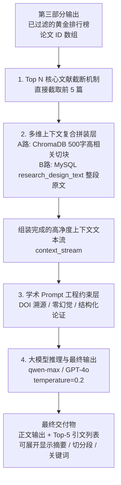

# 第四部分：大模型 RAG 生成模块 —— 系统数据流线框图

> 实现说明 / Implementation Note
>
> 本章描述 Top5 RAG 综述生成的拼装与生成思路，已落地为 `POST /api/analyze/generate`（综述 Prompt 本轮保持不动）。落地差异如下：
>
> | 本章设计（早期） | 当前真实实现 | 说明 |
> | --- | --- | --- |
> | 切块向量回查 ChromaDB | 从 SQLite 取该篇 chunk 向量，用 query 向量算余弦挑最高分 chunk（失败降级取最长 chunk） | 见 02 章实现说明 |
> | 整段文本读 MySQL 主表 | 读 SQLite `papers_master.research_design_text` | 同库 |
> | LLM 为 qwen-max / GPT-4o | **火山方舟 DeepSeek**（`deepseek-v3-2-251201`，OpenAI 兼容），temperature 0.2 | 见 00 章技术栈表 |
>
> 本轮新增：综述能力被明确定位为「文献综述功能」，并补齐自动 / 自选两种模式（`/api/review/auto`、`/api/review/manual`，复用本章综述 Prompt 不改）；另新增「智能问答」用独立 QA Prompt 直接回答问题。两者均见 06 章（T3 / T4）。

## 1. Top N 核心文献截断机制

- 输入来自第三部分输出的已过滤黄金排行榜，形式为论文 ID 数组，例如：`["PAPER_001", "PAPER_089", "PAPER_012", ...]`
- 直接截取排行榜前 5 篇文献 ID：

```python
final_selected_papers = golden_list_paper_ids[:5]
```

- 由于第三部分已经完成过滤，这里无需再做额外逻辑判断，直接取前 5 篇即可得到相关性最高且合规的核心文献

## 2. 多维上下文复合拼装层

- 对这 5 篇文献 ID 逐一循环，在内存中进行两路异构数据调取与融合，拼装成三维一体的 `context_stream`
- A 路，切块层：
  - 回查 ChromaDB 向量库
  - 取出该文在第三部分中得分最高、最相关的一个 500 字文本块
- B 路，整段层：
  - 读取 MySQL 主表
  - 完整注入模块一解构剥离出的整段高浓度 `research_design_text`

### 上下文注入模板

```text
【核心文献】
标题: {title} | DOI: {doi} | 发表年份: {publish_year}
相关语义片段: [A路 向量切块文本]
独立研究设计原文: [B路 MySQL 整段文本]
```

- 目的：解决传统 RAG 中割裂文本块导致大模型难以宏观理解研究设计、变量关联与数据来源的问题

## 3. 学术 Prompt 工程约束层

- 将 `context_stream` 注入具备强审计约束效力的学术级 Prompt 模板中
- 约束规则如下：
  - 规则 1，学术溯源要求：强制大模型在生成的每一处引述、实验数据或结论句末标注对应的 `[DOI]` 锚点
  - 规则 2，零幻觉红线：限制大模型只能基于给定资料回答，若资料中无相关变量数据，必须答“无法得出结论”，严禁编造
  - 规则 3，结构化论证：强迫大模型使用总-分-总话术，分条罗列自变量、因变量与中介路径的关联

## 4. 大模型推理与最终输出

- 将完整 Prompt 投喂给长文本推理大模型，例如 `qwen-max` 或 `GPT-4o`
- 参数调优：设置极低采样随机性，例如 `temperature=0.2`，确保生成逻辑严谨、精确且稳定
- 最终输出：交付具备发表级规范、严格物理挂钩学术溯源、无幻觉的高质量文献综述或研究设计分析报告

### 4.1 输出结果附带引文列表

最终 agent 输出不应只给正文，还应在正文下方附带一份 Top-5 引文列表，用于展示本次生成直接引用或重点依赖的核心文献。这个表建议跟随最终输出一起返回，作为可展开的引用附录。

建议表字段如下：

- 文献标题
- 具体段落或切分段原文
- 作者
- 关键词
- 摘要
- DOI
- 发表年份
- 相关性得分

其中“具体段落”不一定要完整展示，建议采用隐藏式展开设计：默认只显示前若干字或省略号，点击后再展开完整内容。对于 Markdown 场景，可以使用 HTML 的 `<details>` / `<summary>` 方式实现折叠展示；对于前端页面，则可以用折叠面板、抽屉或弹窗。

### 4.2 推荐展示方式

1. 在最终答案正文后追加“引用文献表”。
2. 表格中先显示标题、作者、年份、DOI、关键词等短字段。
3. 对“具体段落”“摘要”这类长字段默认截断，点击后展开。
4. 如果某篇文献的关键段落来自 ChromaDB 切块，则同时展示 chunk_id 或段落定位信息，便于回溯。

### 4.3 对存储侧的依赖

为了支撑这个引文表，前面的存储层需要保留切分段原文，而不仅是向量。也就是说，ChromaDB 中除了 vector 以外，还应保存原文 document、chunk_id、paper_id、offset 或段落位置等元信息，方便后续直接回填到引用表。

## 5. Mermaid 系统数据流图

