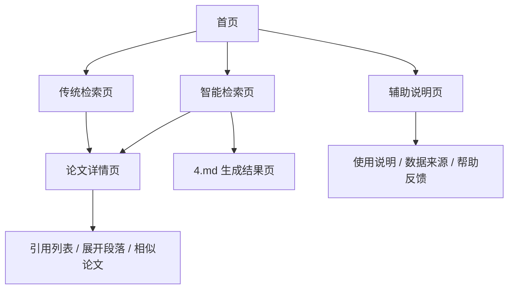

# 第五部分：前端页面设计 —— 系统交互与页面结构说明

> 实现说明 / Implementation Note
>
> 本章的页面信息架构（首页分流、传统检索、智能检索、论文详情）在工程实现中保留。技术栈与本轮交互变化如下：
>
> | 本章设计（早期） | 当前真实实现 | 说明 |
> | --- | --- | --- |
> | 前端技术栈未固定 | Vite + React + TypeScript + Tailwind，Node 用 fnm（`.nvmrc`=22）管理 | 见 00 章 / README |
> | 详情页「正文」按 chunk 碎片化展示 | 详情页正文改为展示拼接连续全文 `full_text`；切分段降级为「命中证据」区（T1） | 见 06 章 T1 |
> | 智能检索仅有「综述」 | 智能检索页拆为：传统检索 / 综述（自动+自选双模式）/ 智能问答三块（T3、T4） | 见 06 章 |
> | 详情页仅展示库内字段 | 详情页新增智能体入口：AI 同读 / AI 概要 / 思维导图（Mermaid 渲染）/ 相关文献（T5） | 见 06 章 T5 |
>
> 前端 API 客户端与类型定义见 `frontend/src/api/client.ts` + `types.ts`，新增字段以 `docs/dev-contract.md` 为唯一真相。

## 1. 设计目标

前端的职责不是单纯展示数据，而是把整套信息存储与检索链路组织成一个清晰、可操作、可解释的交互系统。页面设计需要满足以下目标：

- **清晰分流**：用户一进入系统就能明确选择传统检索或智能检索。
- **低认知成本**：页面层级尽量少，按钮和结果区块直接对应业务流程。
- **可解释性**：论文详情页要展示数据库中保存的核心信息，便于理解检索结果来源。
- **可扩展性**：后续可以继续加入收藏、导出、对比、历史记录等功能。
- **移动端兼容**：桌面端和移动端都能稳定浏览和操作。

## 2. 页面总览

建议前端至少包含以下页面：

1. 首页
2. 传统检索页
3. 论文详情页
4. 智能检索页
5. 辅助说明页

其中，首页负责入口分流，传统检索页负责类知网式检索与排序，论文详情页负责展示数据库存储信息与论文全文，智能检索页负责自然语言分析检索，辅助说明页负责解释系统工作方式和数据来源。

## 3. 首页设计

首页的核心任务是让用户迅速理解“这个系统能做什么、应该怎么选”。

### 3.1 页面结构

- 顶部导航栏：系统名称、功能入口、帮助说明、返回首页。
- 主视觉区：系统简介、关键词标签、两个主入口按钮。
- 功能卡片区：传统检索、智能检索、论文详情、导出与历史记录。
- 底部说明区：数据来源、检索范围、免责声明。

### 3.2 主入口按钮

- **传统检索**：进入结构化条件检索页，适合已知作者、年份、期刊、关键词的场景。
- **智能检索**：进入自然语言检索页，适合输入研究问题、研究主题或模糊需求。

### 3.3 首页文案建议

- “面向信息存储与检索课程的文献检索与分析系统”
- “支持结构化检索、语义检索、论文详情回溯与大模型辅助分析”

## 4. 传统检索页

传统检索页对应用户“只看文献、不要大模型分析”的场景，目标是尽量复刻知网式的检索体验。

### 4.1 页面组成

- 左侧筛选区：作者、年份、期刊、学科、关键词、布尔条件。
- 中间结果区：论文列表、相关性排序、分页。
- 右侧辅助区：检索热词、最近查询、筛选历史。

### 4.2 检索交互

- 用户输入结构化条件后点击“开始检索”。
- 系统展示相关性排序结果，而不是单纯返回匹配到的文献。
- 对完全不相关的论文进行弱化或隐藏，减少噪声。
- 用户可点击排序结果进入论文详情页。

### 4.3 结果展示字段

建议结果卡片至少显示以下内容：

- 标题
- 作者
- 发表年份
- 期刊
- 关键词
- 摘要摘要预览
- 相关性分数或排序名次

### 4.4 传统检索页补充说明

- 可以提供“按相关性”“按年份”“按引用数”切换排序。
- 可以提供“只看标题命中”“只看关键词命中”的辅助筛选。
- 可以提供“导出当前结果”按钮。

## 5. 论文详情页

论文详情页是整个系统里最重要的解释页面之一，用来展示数据库中实际保存的信息。

### 5.1 页面目标

- 展示论文的完整元数据。
- 展示 MySQL 中保存的研究设计大文本。
- 展示 ChromaDB 中回溯到的切分段原文。
- 展示与该论文相关的检索命中信息。

### 5.2 页面结构

- 顶部：论文标题、作者、DOI、年份、期刊、引用按钮。
- 中部：摘要、关键词、研究设计文本、全文分段展示。
- 右侧：检索命中情况、相关论文推荐、引用列表入口。
- 底部：相似论文、收藏、下载、复制引用格式。

### 5.3 数据展示要求

论文详情页至少要展示以下字段：

- 文献标题
- 作者
- DOI
- 发表年份
- 关键词
- 摘要
- 研究设计文本
- 关键切分段原文
- 相关性分数或命中字段

### 5.4 折叠与隐藏设计

由于摘要、研究设计文本和切分段原文都可能较长，不建议一次性全部展开：

- 默认只显示前几行或前若干字。
- 使用“展开/收起”按钮控制完整内容显示。
- 对重要切分段采用卡片折叠展示。
- 对长段原文可以使用抽屉、弹窗或手风琴展开。

### 5.5 论文详情页补充功能

- DOI 一键跳转。
- 引用格式复制（GB/T、APA、MLA）。
- 相似论文推荐。
- 收藏到个人列表。

## 6. 智能检索页

智能检索页对应用户选择“大模型分析检索”的场景。

### 6.1 页面组成

- 上方输入框：自然语言问题。
- 中部配置区：是否启用过滤条件、是否启用扩展词、是否显示解释。
- 下方结果区：黄金排行榜、推荐摘要、相关解释。
- 右侧输出区：可直接跳转到 4.md 对应的生成结果。

### 6.2 智能检索流程

1. 用户输入研究问题。
2. 系统将其结构化为查询包。
3. 同时触发关键词检索和语义检索。
4. 结果进行融合排序。
5. 展示检索结果，并允许进一步进入生成分析。

### 6.3 智能检索结果展示

建议结果列表显示：

- 标题
- 作者
- 关键词命中情况
- 语义相似提示
- 排名
- 进入详情页按钮

### 6.4 与 4.md 的联动

智能检索页里应该提供一个明显的“进入分析”按钮，将前 5 篇文献送入 4.md 的上下文拼装与大模型输出流程。

## 7. 辅助说明页

建议增加一些辅助页面，提升整套系统的可用性和解释性。

### 7.1 使用说明页

- 解释传统检索和智能检索的区别。
- 说明如何输入作者、年份、关键词等条件。
- 说明检索结果为什么会有相关性排序。

### 7.2 数据来源说明页

- 说明数据来自 1000 篇 Word 文献与外部元数据。
- 说明 MySQL 和 ChromaDB 分别负责什么。
- 说明为什么要保存切分段原文和定位信息。

### 7.3 检索历史页

- 记录最近的检索条件。
- 方便回看之前的搜索。
- 可以支持重新检索、收藏和导出。

### 7.4 帮助与反馈页

- 常见问题说明。
- 检索结果不准确时的反馈入口。
- 对“为什么某篇论文排前面”的解释入口。

## 8. 前端信息架构

## 9. 视觉与交互建议

- 首页建议使用明显的双入口设计，让用户一眼区分传统检索和智能检索。
- 传统检索页建议偏“工具型”，结果区清晰、筛选控件密集、排序强。
- 智能检索页建议偏“对话型”，输入框更突出，结果解释更丰富。
- 论文详情页建议偏“阅读型”，强调正文、摘要、引文和段落展开。
- 长内容统一使用折叠、悬浮、抽屉、弹窗等方式减少视觉负担。

## 10. 与后端文档的对应关系

- [第一部分](01-数据预处理.md)：决定首页背后数据如何被预处理。
- [第二部分](02-数据存储.md)：决定论文详情页和检索结果页可展示哪些数据库字段。
- [第三部分](03-检索与排序.md)：决定传统检索页和智能检索页的前后端分流逻辑。
- [第四部分](04-RAG生成.md)：决定智能检索页最终如何进入生成分析结果页。

## 11. 小结

这套前端设计的重点不是做很多页面，而是把检索系统的行为拆成用户容易理解的几个入口：

- 想快速找论文，就去传统检索页。
- 想用自然语言提问，就去智能检索页。
- 想看论文内容与数据库信息，就去论文详情页。
- 想理解系统怎么工作的，就去辅助说明页。

这样前端就和后端文档链路完全对齐了。