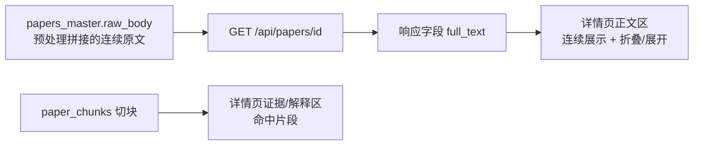
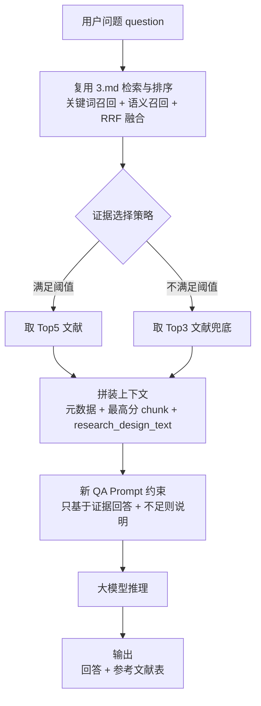
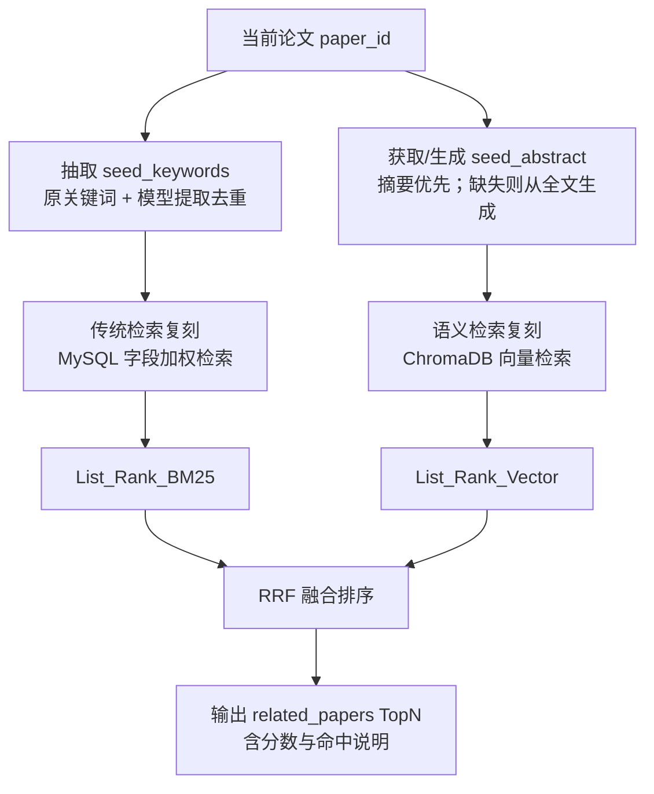

# 学术智能体

> 实现说明 / Implementation Note
>
> 本章承接 [01-数据预处理](01-数据预处理.md) 至 [05-前端设计](05-前端设计.md) 的「数据 → 检索 → RAG → 前端」主干，记录在其之上扩出的一组学术智能体能力（详情页连续全文、语义检索修复、文献综述双模式、智能问答 RAG-QA、详情页四智能体）。设计上恪守两条底线：**既有「文献综述」Prompt 原样不动**；**新增能力一律用新 Prompt 或新调用方式实现**，避免影响既有综述链路稳定性。接口契约以 [dev-contract.md](dev-contract.md) 为唯一真相源。
>
> 真实技术栈：Go（主业务/检索/路由）+ React（暗色科技终端风）+ Python FastAPI 侧车（解析/嵌入/LLM）+ SQLite（关系表 + 内嵌向量 BLOB）+ 本地 `BAAI/bge-small-zh-v1.5` 嵌入 + 火山方舟 DeepSeek（`deepseek-v3-2-251201`，OpenAI 兼容）LLM。工具链 uv（Python）/ fnm（Node）/ go。

## 1. 总体定位

学术智能体并非独立子系统，而是把第 03~04 章的检索与 RAG 底座以不同的「选证据 + 提示词」组合，包装成面向用户问题与单篇阅读的若干能力。划分如下：

| 编号 | 能力 | 入口 | 是否调 LLM | 复用的底座 |
| --- | --- | --- | --- | --- |
| T1 | 详情页连续全文 | `GET /api/papers/{id}`（增 `full_text`） | 否 | 预处理产出的 `raw_body` |
| T2 | 语义检索修复 | `/api/search/smart` 向量路 | 仅 rewrite | 本地 BGE 嵌入 + 向量索引 |
| T3 | 文献综述双模式 | `/api/review/auto`、`/api/review/manual` | 是（现有综述 Prompt） | smart 检索 + `/generate` |
| T4 | 智能问答 RAG-QA | `/api/qa/answer` | 是（**新 QA Prompt**） | smart 检索（rewrite→BM25∪向量→RRF） |
| T5 | 详情页四智能体 | `/api/papers/{id}/{chat,summary,mindmap,related}` | chat/summary/mindmap 是，**related 否** | 单篇上下文 + 双路 RRF |

## 2. T1 · 详情页连续全文

### 2.1 问题

详情页原先按 chunk / 段落碎片化展示正文，不利于连续阅读；而向量库的 chunk 是为语义召回切的，不适合作为「正文」主形态。

### 2.2 链路

预处理阶段（模块 1）已把 Word 按阅读顺序拼接为连续全文，段落间以 `\n\n` 分隔，落库到 `papers_master.raw_body`（见 01 章实现说明）。因此 T1 **无需新增列、无需重摄取**，仅在详情接口上把该字段暴露出来：

### 2.3 表现

- 详情页正文以单一连续 `full_text` 展示，默认折叠前 N 行、可展开全文；
- 原 chunk 切块降级为独立的「关键切分段 / 命中片段」区，用于解释「为什么命中」，不再混入正文。

## 3. T2 · 语义检索修复

### 3.1 现象与根因

智能检索的语义路曾对常见查询返回空。根因是**库内 chunk 未带嵌入**：`paper_chunks.embedding` 为空时向量召回必然落空，整条向量路退化为 0 候选。维度不一致、白名单过滤过严、阈值剪枝过早等也会造成类似「看似不可用」。

### 3.2 修复

核心修复是**带嵌入重新摄取**：ingest 走本地 `BAAI/bge-small-zh-v1.5`，把每个 chunk 的 float32 向量按 little-endian → base64 → BLOB 落入 `paper_chunks.embedding`（与 Go `store.DecodeVector` 对称）。配套观测与稳态约束：

- 召回阶段 `top_k` 取较大值（先召回后融合），避免过早剪枝；
- 嵌入失败时整条向量路降级、golden 退化为 BM25 列表（优雅降级，见 00 章 P3）；
- 记录 query、向量生成耗时、过滤后候选数、返回数，便于定位空结果。

修复后语义路对样例查询稳定返回非空，T4 / T5 的相关文献等下游能力才得以建立在可用的向量召回之上。

## 4. T3 · 文献综述双模式

综述能力从「智能检索大模块」收敛为一个明确的「文献综述」功能，提供自动与自选两种选文方式，**两者都复用既有综述 Prompt（不修改）**，仅在「证据从哪来」上分流。

### 4.1 自动综述 · `/api/review/auto`

输入主题 `{q}` → 走 smart 检索（rewrite→BM25∪向量→RRF）取黄金榜 Top5 → 调 Python `/generate`（现有综述 Prompt）→ 返回 `{answer, citations}`，与 `/api/analyze/generate` 同形。

### 4.2 自选综述 · `/api/review/manual`

输入 `{doi? | title? | text?}`：

- `doi` / `title`：在库内做**精确匹配**取单篇（区别于自动综述的模糊检索），定位失败返回 404 `{"error":"未能精确定位到库内文献"}`；
- `text`：前端读出 `.txt/.docx` 的纯文本后直接作为单篇证据传入（本轮后端不做文件解析）。

取到单篇证据后同样调 `/generate`，响应在综述基础上附 `matched:{paper_id,title}|null`。

## 5. T4 · 智能问答 RAG-QA

智能问答的目标是**直接回答用户问题**（非综述/报告），系统自动选证据，回答末尾附参考文献表。

### 5.1 链路

### 5.2 证据选择

复用 smart 检索的黄金排行榜：默认取 Top5；当第 3 名之后出现**断崖**（次名分数 < 前一名 × 0.5）或候选不足 5 篇时，退为 Top3 兜底并置 `evidence_sufficient=false`，避免硬凑无关文献。对每篇取其最高分 chunk + `research_design_text` 组成上下文（兼顾命中证据与方法学可解释性）。

### 5.3 生成与组装

- Python `POST /qa` 用**独立于综述的新 QA Prompt**：只基于提供的证据回答；无证据时必须答「证据不足，无法回答」；输出 = 直接回答 + 依据（DOI 锚点）；`evidence_sufficient=false` 时在开头提示可信度有限。Py 只产出 `answer`。
- Go 侧用入参 papers 组装 `references[]`（`rank/paper_id/title/author/year/doi/journal/matched_by/score/snippet`），最终响应 `{answer, evidence_sufficient, references[]}`。前端在回答下方以表格渲染参考文献。

## 6. T5 · 详情页四智能体

详情页提供一个以**该论文全字段为上下文**的智能体入口，上下文含 title/author/doi/publish_year/journal/keywords/abstract/research_design_text 以及 T1 的 `full_text`。四个能力各走独立 Prompt（除 related 外）。

| 能力 | 接口 | 行为 | 实现侧 |
| --- | --- | --- | --- |
| AI 同读 | `POST /api/papers/{id}/chat` | 基于该论文作答，越界则答「论文未提供」 | Python `/chat` |
| AI 概要 | `POST /api/papers/{id}/summary` | 产出概要 / 方法 / 结果 / 关键词[5-10] | Python `/summary` |
| 思维导图 | `POST /api/papers/{id}/mindmap` | 产出可直接渲染的 mermaid `mindmap`（不含围栏） | Python `/mindmap` |
| 相关文献 | `POST /api/papers/{id}/related` | 双路召回 + RRF 取 TopN=20 | **纯 Go，不调 LLM** |

### 6.1 chat / summary / mindmap

三者均把单篇完整上下文传给 Python 各自独立的 Prompt 调 LLM。`chat` 只基于该论文事实作答；`summary` 用提示词工程稳定产出 `{summary,method,result,keywords[]}`；`mindmap` 产出合法的 mermaid `mindmap` 语法（前端用 `components/Mindmap.tsx` 渲染）。

### 6.2 相关文献检索（纯 Go 双路 + RRF）

相关文献以当前论文为种子，复刻系统两路检索能力再加权融合，**全程纯 Go、不调 LLM**：`seed_keywords` 来自该论文 keywords 分词走 BM25 字段加权；`seed` 向量取该论文已存的最高信息 chunk 向量（或对 abstract 现算）走语义召回；两路经 RRF 融合后去掉自身，取 TopN=20。

> 上图沿用建议稿的概念示意；本仓库的真实实现中「传统检索复刻」走 Go 内存 BM25 字段加权、「语义检索复刻」走 SQLite 内嵌向量召回（非 MySQL/ChromaDB，统一裁剪见 00 章），且 `seed_keywords/seed_abstract` 取该论文已有字段，related 不调用 LLM。

响应 `{related_papers:[{paper_id,title,author,year,doi,journal,score,matched_by}]}`，`matched_by ∈ {关键词, 语义, 关键词+语义}`，便于前端解释命中来源。

## 7. 前端落点

| 能力 | 页面 / 组件 |
| --- | --- |
| 智能问答 | `frontend/src/pages/QA.tsx` |
| 文献综述（自动/自选） | `frontend/src/pages/Review.tsx` |
| 检索页（传统 / 智能 / 问答 tab 聚合） | `frontend/src/pages/Search.tsx` |
| 侧边导航 | `frontend/src/components/Sidebar.tsx` |
| 思维导图渲染 | `frontend/src/components/Mindmap.tsx` |
| 详情页四智能体 | 详情页内嵌入口，调用上述 `/api/papers/{id}/*` |

前端类型须与平铺字段逐一对齐：`Paper` 增 `full_text`，并新增 `QaResponse / Reference / ReviewResponse / SummaryResponse / MindmapResponse / ChatResponse / RelatedResponse`（见 [dev-contract.md](dev-contract.md) 第 3 节）。
